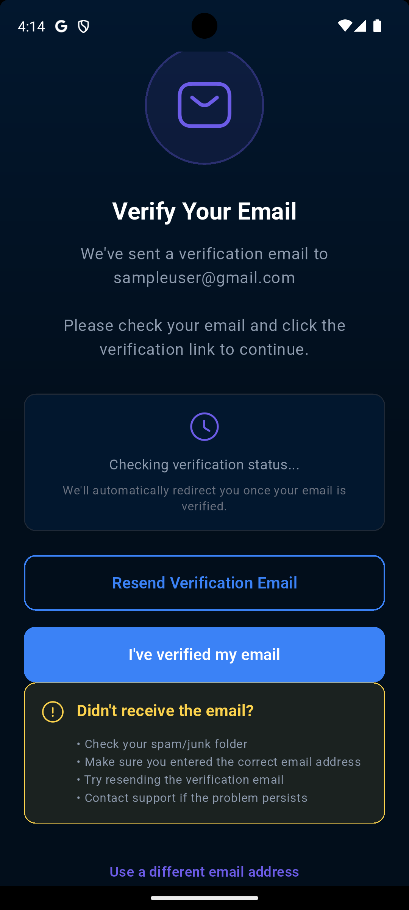
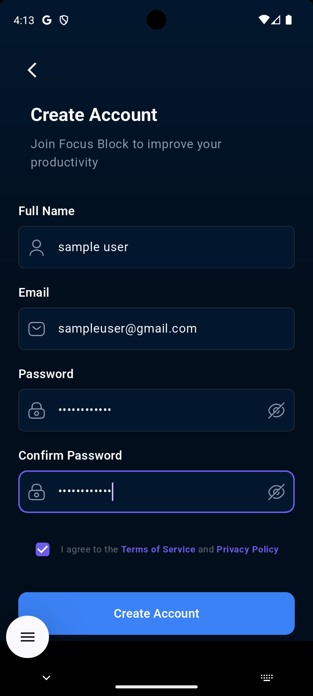
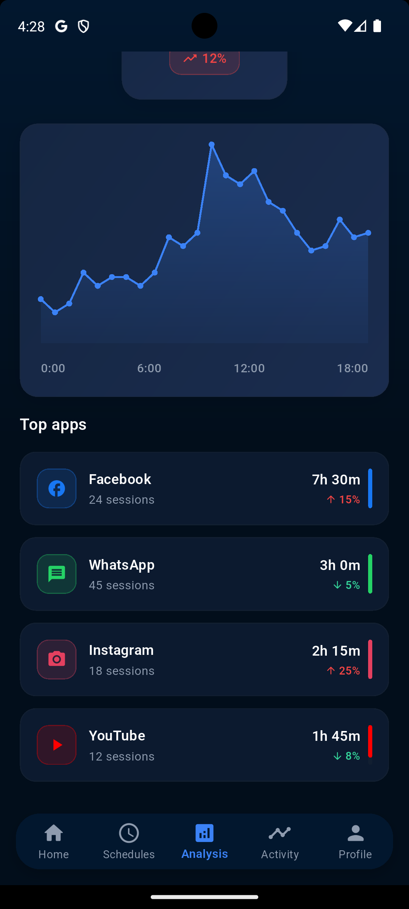
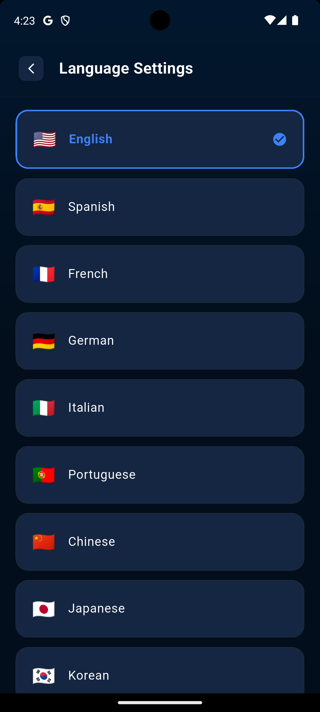
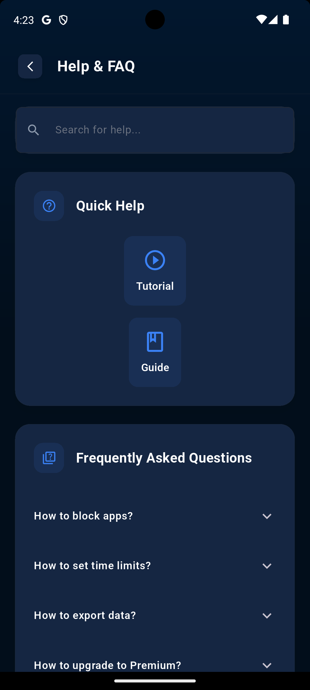

# 🧠 BlockMind - Digital Wellness & App Blocking Solution

<div align="center">


[](https://flutter.dev)
[](https://firebase.google.com)
[](https://dart.dev)

[](https://github.com/blockmind/blockmind/releases)
[](LICENSE)
[](https://github.com/blockmind/blockmind)

**Transform your digital habits. Reclaim your focus. Achieve digital wellness.**

[📱 Download](#-download) • [🚀 Features](#-key-features) • [📖 Documentation](#-documentation) • [🤝 Contributing](#-contributing)

</div>

---

## 🌟 Overview

BlockMind is a comprehensive **digital wellness application** built with **Flutter** and powered by **Firebase**, designed to help users manage screen time, improve productivity, and maintain healthy digital habits. With intelligent app blocking, advanced analytics, and AI-powered assistance, BlockMind empowers users to take control of their digital lives.

<div align="center">


### 🎯 **Mission Statement**
*Empowering individuals to build meaningful relationships with technology through mindful usage and digital wellness.*

</div>

---

## ✨ Key Features

<div align="center">

<table>
<tr>
<td width="25%" align="center">


### 🚫 **Smart App Blocking**
- **Instant Blocking** - Quick block with customizable durations
- **Scheduled Sessions** - Automated blocking based on your routine
- **Category Filtering** - Block by app categories
- **Emergency Override** - Break glass when truly needed
- **Whitelist Support** - Keep essential apps accessible

</td>
<td width="25%" align="center">


### 📊 **Advanced Analytics**
- **Multi-timeframe Reports** - Daily, weekly, monthly insights
- **Usage Pattern Analysis** - Understand your digital behavior
- **Productivity Scoring** - Track your progress with metrics
- **Goal Achievement** - Set and monitor digital wellness goals
- **Export Capabilities** - Share your progress

</td>
<td width="25%" align="center">


### 🤖 **AI-Powered Assistant**
- **Personalized Recommendations** - Tailored advice for your habits
- **24/7 Support** - Always available digital wellness coach
- **Motivational Guidance** - Stay motivated on your journey
- **Habit Formation** - Science-backed habit building
- **Schedule Optimization** - AI suggests optimal blocking times

</td>
<td width="25%" align="center">


### 🎨 **Personalization**
- **Custom Themes** - Light/dark mode and color schemes
- **Multi-language Support** - Available in multiple languages
- **Flexible Scheduling** - Create schedules that fit your life
- **Privacy Controls** - Complete control over your data
- **Backup & Sync** - Never lose your progress

</td>
</tr>
</table>

</div>

---

## 📱 Screenshots & User Journey

### 🔐 Authentication & Onboarding

<div align="center">

#### Initial Screens
<table>
<tr>
<td align="center">
<br/>
<strong>Welcome Screen</strong>
</td>
<td align="center">
<br/>
<strong>Registration Options</strong>
</td>
<td align="center">
<br/>
<strong>Login Screen</strong>
</td>
<td align="center">
<br/>
<strong>Email Verification</strong>
</td>
</tr>
</table>

#### Authentication Flow
<table>
<tr>
<td align="center">
<br/>
<strong>Manual Registration</strong>
</td>
<td align="center">
<br/>
<strong>Manual Login</strong>
</td>
<td align="center">
<br/>
<strong>Password Recovery</strong>
</td>
</tr>
</table>

#### Onboarding Experience
<table>
<tr>
<td align="center">
<br/>
<strong>Welcome Guide</strong>
</td>
<td align="center">
<br/>
<strong>Features Overview</strong>
</td>
<td align="center">
<br/>
<strong>Setup Guide</strong>
</td>
<td align="center">
<br/>
<strong>Get Started</strong>
</td>
</tr>
</table>

</div>

**🔑 Key Authentication Highlights:**
- 🔐 **Secure Authentication** - Multiple login methods including social media
- ✉️ **Email Verification** - Enhanced security with email confirmation
- 🎓 **Interactive Onboarding** - Step-by-step introduction to features
- 🚀 **Quick Setup** - Get started in under 2 minutes

---

### 🏠 Home Dashboard & Quick Actions

<div align="center">

#### Main Dashboard
<table>
<tr>
<td align="center">
<br/>
<strong>Main Dashboard</strong>
</td>
<td align="center">
<br/>
<strong>Quick Block Feature</strong>
</td>
<td align="center">
<br/>
<strong>Active Sessions</strong>
</td>
<td align="center">
<br/>
<strong>Timer Interface</strong>
</td>
</tr>
</table>

#### Block Management
<table>
<tr>
<td align="center">
<br/>
<strong>App Selection</strong>
</td>
<td align="center">
<br/>
<strong>Create Block Session</strong>
</td>
<td align="center">
<br/>
<strong>Start Block Confirmation</strong>
</td>
<td align="center">
<br/>
<strong>Reset Options</strong>
</td>
</tr>
</table>

</div>

**⚡ Key Home Features:**
- 🚫 **Quick Block** - Start blocking sessions in seconds
- 📊 **Real-time Monitoring** - Live tracking of active sessions
- 🎯 **Smart Selection** - Choose apps by category or individually
- 🕐 **Flexible Timing** - Custom durations from 15 minutes to hours

---

### 📅 Schedule Management

<div align="center">

<table>
<tr>
<td align="center">
<br/>
<strong>All Schedules</strong>
</td>
<td align="center">
<br/>
<strong>Create New Schedule</strong>
</td>
<td align="center">
<br/>
<strong>Schedule Details</strong>
</td>
<td align="center">
<br/>
<strong>Calendar Overview</strong>
</td>
</tr>
</table>

<table>
<tr>
<td align="center">
<br/>
<strong>Delete Confirmation</strong>
</td>
</tr>
</table>

</div>

**📅 Schedule Management Features:**
- 📋 **Flexible Scheduling** - Daily, weekly, or custom patterns
- 🎨 **Visual Calendar** - See your blocking schedule at a glance
- ⚙️ **Easy Management** - Create, edit, and delete schedules effortlessly
- 🔄 **Smart Recurrence** - Set up complex recurring patterns

---

### 📊 Activity Tracking & Analytics

<div align="center">

#### Activity Monitoring
<table>
<tr>
<td align="center">
<br/>
<strong>All Activities</strong>
</td>
<td align="center">
<br/>
<strong>Today's Activities</strong>
</td>
<td align="center">
<br/>
<strong>Getting Started</strong>
</td>
</tr>
</table>

#### Usage Analysis & Insights
<table>
<tr>
<td align="center">
<br/>
<strong>Daily Analysis</strong>
</td>
<td align="center">
<br/>
<strong>Daily Breakdown</strong>
</td>
<td align="center">
<br/>
<strong>Weekly Analysis</strong>
</td>
<td align="center">
<br/>
<strong>Monthly Analysis</strong>
</td>
</tr>
</table>

</div>

**📈 Analytics Features:**
- 📊 **Comprehensive Reports** - Multi-timeframe analysis
- 📈 **Trend Analysis** - Understand your progress over time
- 🎯 **Goal Tracking** - Monitor achievement of wellness goals
- 📋 **Detailed Insights** - Hour-by-hour breakdown and patterns

---

### 🤖 AI Assistant & Support

<div align="center">

<table>
<tr>
<td align="center">
<br/>
<strong>AI Chatbot Interface</strong>
</td>
<td align="center">
<br/>
<strong>Intelligent Conversations</strong>
</td>
</tr>
</table>

</div>

**🤖 AI Assistant Features:**
- 🧠 **Smart Assistant** - AI-powered recommendations and support
- 💬 **Natural Conversation** - Intuitive chat interface
- 🎯 **Personalized Advice** - Custom recommendations based on your usage
- 🌟 **24/7 Availability** - Always there when you need guidance

---

### 👤 Profile & Settings

<div align="center">

#### Profile Management
<table>
<tr>
<td align="center">
<br/>
<strong>Main Profile</strong>
</td>
<td align="center">
<br/>
<strong>Settings Menu</strong>
</td>
<td align="center">
<br/>
<strong>Account Settings</strong>
</td>
<td align="center">
<br/>
<strong>Account Details</strong>
</td>
</tr>
</table>

#### Customization Options
<table>
<tr>
<td align="center">
<br/>
<strong>Notifications</strong>
</td>
<td align="center">
<br/>
<strong>Theme Settings</strong>
</td>
<td align="center">
<br/>
<strong>Language Options</strong>
</td>
<td align="center">
<br/>
<strong>Time Management</strong>
</td>
</tr>
</table>

#### Advanced Settings
<table>
<tr>
<td align="center">
<br/>
<strong>Backup & Restore</strong>
</td>
<td align="center">
<br/>
<strong>Privacy Settings</strong>
</td>
<td align="center">
<br/>
<strong>Help & FAQ</strong>
</td>
<td align="center">
<br/>
<strong>About BlockMind</strong>
</td>
</tr>
</table>

</div>

**👤 Profile Features:**
- 🏆 **Achievement System** - Gamified progress tracking
- ⚙️ **Deep Customization** - Tailor the app to your preferences
- 🔒 **Privacy First** - Complete control over your data
- 🌍 **Multi-language Support** - Available in multiple languages

---

## 🛠️ Technical Stack

<div align="center">

<table>
<tr>
<th width="30%">Category</th>
<th width="70%">Technologies</th>
</tr>
<tr>
<td><strong>Frontend</strong></td>
<td>Flutter, Dart</td>
</tr>
<tr>
<td><strong>Backend</strong></td>
<td>Firebase (Auth, Firestore, Cloud Functions)</td>
</tr>
<tr>
<td><strong>Local Storage</strong></td>
<td>SharedPreferences, Hive</td>
</tr>
<tr>
<td><strong>Authentication</strong></td>
<td>Firebase Auth, OAuth 2.0</td>
</tr>
<tr>
<td><strong>Analytics</strong></td>
<td>Custom Analytics Engine</td>
</tr>
<tr>
<td><strong>State Management</strong></td>
<td>Provider / Bloc</td>
</tr>
<tr>
<td><strong>Notifications</strong></td>
<td>Firebase Cloud Messaging</td>
</tr>
</table>

</div>

---

## 🚀 Getting Started

### 📋 Prerequisites

- Flutter SDK (3.0+)
- Dart SDK (2.17+)
- Android Studio / VS Code
- Firebase Account

### 💻 Installation

```bash
# Clone the repository
git clone https://github.com/blockmind/blockmind.git

# Navigate to project directory
cd blockmind

# Install dependencies
flutter pub get

# Run the app
flutter run
```

### 🔧 Configuration

1. **Firebase Setup**
   ```bash
   # Install Firebase CLI
   npm install -g firebase-tools
   
   # Login to Firebase
   firebase login
   
   # Initialize Firebase in your project
   firebase init
   ```

2. **Add Firebase Configuration Files**
   - Download `google-services.json` for Android and place in `android/app/`
   - Download `GoogleService-Info.plist` for iOS and place in `ios/Runner/`

3. **Environment Setup**
   ```yaml
   # pubspec.yaml dependencies
   dependencies:
     flutter:
       sdk: flutter
     firebase_core: ^2.15.0
     firebase_auth: ^4.7.2
     cloud_firestore: ^4.8.4
     shared_preferences: ^2.2.0
     hive: ^2.2.3
   ```

---

## 📖 Architecture Overview

```
┌─────────────────┐    ┌─────────────────┐    ┌─────────────────┐
│   Presentation  │    │    Business     │    │      Data       │
│     Layer       │◄──►│     Logic       │◄──►│     Layer       │
│                 │    │     Layer       │    │                 │
│ • Flutter UI    │    │ • Provider/Bloc │    │ • Firebase      │
│ • Widgets       │    │ • Services      │    │ • Local Storage │
│ • Screens       │    │ • Repositories  │    │ • Hive/SharedP  │
└─────────────────┘    └─────────────────┘    └─────────────────┘
```

### 📁 Project Structure

```
lib/
├── core/
│   ├── constants/
│   ├── utils/
│   └── services/
├── features/
│   ├── auth/
│   │   ├── data/
│   │   ├── domain/
│   │   └── presentation/
│   ├── home/
│   ├── schedule/
│   ├── analytics/
│   ├── profile/
│   └── chatbot/
├── shared/
│   ├── widgets/
│   ├── models/
│   └── providers/
└── main.dart
```

---

## 🔧 Key Components

### 🚫 App Blocking Service

```dart
class AppBlockingService {
  static Future<void> startBlockSession({
    required List<String> blockedApps,
    required Duration duration,
    required BlockType type,
  }) async {
    // Implementation for starting app blocking
  }

  static Future<void> stopBlockSession(String sessionId) async {
    // Implementation for stopping app blocking
  }

  static Stream<List<BlockSession>> getActiveBlocks() {
    // Stream of active blocking sessions
  }
}
```

### 📊 Analytics Engine

```dart
class AnalyticsService {
  static Future<UsageReport> generateReport(TimeFrame timeframe) async {
    // Generate usage analytics report
  }

  static Future<double> calculateProductivityScore() async {
    // Calculate user productivity score
  }

  static Future<void> trackAppUsage(String appId, Duration duration) async {
    // Track app usage for analytics
  }
}
```

### 🤖 AI Assistant

```dart
class AIAssistantService {
  static Future<List<Recommendation>> getRecommendations(
    UserProfile profile
  ) async {
    // Get personalized recommendations
  }

  static Future<String> getChatResponse(String message) async {
    // Process chat messages and return AI response
  }
}
```

---

## 🔒 Privacy & Security

<div align="center">

### 🛡️ **Privacy First Approach**

</div>

<table>
<tr>
<th width="30%">Aspect</th>
<th width="70%">Implementation</th>
</tr>
<tr>
<td><strong>Data Encryption</strong></td>
<td>End-to-end encryption for all sensitive data</td>
</tr>
<tr>
<td><strong>Local Processing</strong></td>
<td>Analytics processed locally when possible</td>
</tr>
<tr>
<td><strong>Minimal Collection</strong></td>
<td>Only collect data essential for functionality</td>
</tr>
<tr>
<td><strong>User Control</strong></td>
<td>Complete control over data sharing preferences</td>
</tr>
<tr>
<td><strong>GDPR Compliant</strong></td>
<td>Full compliance with privacy regulations</td>
</tr>
<tr>
<td><strong>Firebase Security</strong></td>
<td>Advanced security rules and authentication</td>
</tr>
</table>

### 🔐 Security Features

- 🔒 **Secure Authentication** - Firebase Auth with multi-factor support
- 🛡️ **Data Protection** - Firestore security rules and encryption
- 🔄 **Regular Updates** - Continuous security improvements
- 📋 **Privacy Controls** - Granular privacy settings
- 🎯 **Minimal Permissions** - Only request necessary device permissions

---

## 🤝 Contributing

We welcome contributions from the community! Here's how you can get involved:

### 🎯 Ways to Contribute

<div align="center">

<table>
<tr>
<td width="33%" align="center">

#### 🐛 **Bug Reports**
- Report issues via GitHub Issues
- Provide detailed reproduction steps
- Include device and OS information
- Screenshots welcome

</td>
<td width="33%" align="center">

#### ✨ **Feature Requests**
- Suggest new features
- Discuss implementation approaches
- Vote on existing proposals
- Help prioritize development

</td>
<td width="33%" align="center">

#### 💻 **Code Contributions**
- Fork the repository
- Create feature branches
- Submit pull requests
- Follow Flutter/Dart conventions

</td>
</tr>
</table>

</div>

### 📋 Contribution Guidelines

1. **Fork** the repository
2. **Create** a feature branch (`git checkout -b feature/amazing-feature`)
3. **Commit** your changes (`git commit -m 'Add amazing feature'`)
4. **Push** to the branch (`git push origin feature/amazing-feature`)
5. **Open** a Pull Request

### 🎨 Development Standards

- **Code Style**: Follow Dart/Flutter style guide
- **Testing**: Write unit and widget tests
- **Documentation**: Update documentation for new features
- **Performance**: Ensure no performance regressions

---


## 💬 Community & Support

<div align="center">

### 🌐 **Join Our Community**

[](https://discord.gg/blockmind)
[](https://twitter.com/blockmind)
[](https://reddit.com/r/blockmind)

</div>

### 💌 Support Channels

- 📧 **Email**: support@blockmind.app
- 💬 **Live Chat**: Available in-app 24/7
- 📚 **Documentation**: [docs.blockmind.app](https://docs.blockmind.app)
- 🎥 **Video Tutorials**: [YouTube Channel](https://youtube.com/blockmind)

---

## 📄 License

This project is licensed under the MIT License - see the [LICENSE](LICENSE) file for details.

```
MIT License

Copyright (c) 2024 MAD Developers Solutions - NSBM Green University

Permission is hereby granted, free of charge, to any person obtaining a copy
of this software and associated documentation files (the "Software"), to deal
in the Software without restriction, including without limitation the rights
to use, copy, modify, merge, publish, distribute, sublicense, and/or sell
copies of the Software, and to permit persons to whom the Software is
furnished to do so, subject to the following conditions:

The above copyright notice and this permission notice shall be included in all
copies or substantial portions of the Software.

THE SOFTWARE IS PROVIDED "AS IS", WITHOUT WARRANTY OF ANY KIND, EXPRESS OR
IMPLIED, INCLUDING BUT NOT LIMITED TO THE WARRANTIES OF MERCHANTABILITY,
FITNESS FOR A PARTICULAR PURPOSE AND NONINFRINGEMENT. IN NO EVENT SHALL THE
AUTHORS OR COPYRIGHT HOLDERS BE LIABLE FOR ANY CLAIM, DAMAGES OR OTHER
LIABILITY, WHETHER IN AN ACTION OF CONTRACT, TORT OR OTHERWISE, ARISING FROM,
OUT OF OR IN CONNECTION WITH THE SOFTWARE OR THE USE OR OTHER DEALINGS IN THE
SOFTWARE.
```

---

## 👨‍💻 Development Team

<div align="center">

**Developed with ❤️ by MAD Developers Solutions**  
*NSBM Green University*

[](https://github.com/mad-developers)
[](https://nsbm.ac.lk)

</div>

---

## 🙏 Acknowledgments

- **Flutter Team** - For the amazing cross-platform framework
- **Firebase Team** - For the comprehensive backend services
- **Open Source Community** - For the incredible libraries and tools
- **NSBM Green University** - For supporting our development journey
- **Beta Testers** - For helping us improve the app

---

<div align="center">

**Start your journey to better digital habits today with BlockMind!**

⭐ **Star this repository if you found it helpful!** ⭐

</div>
